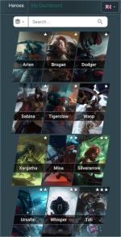
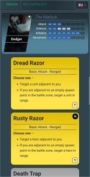
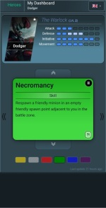
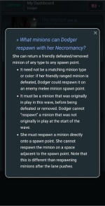

# Guards of Atlantis 2 - FAQ

This companion app for the boardgame Guards of Atlantis 2 (2nd printing) aims to ease the
experience for new players by providing card translations and FAQs to clarify confusing or
unexpected rules and interactions. The intention is **not** to provide strategy guides or
a lookup for information that's meant to be fuzzy by the games designers.

## How to use

### Hero Overview
Select a hero of your choice in the hero selection. Here you can see their profile
and a list of all available cards. Any card with a **[?!]** in the bottom right corner
has FAQ entries attached to it. Click or tap on the card to reveal
the questions and answers.  

### Personal Dashboard
Bookmark your hero for the game with your dashboard by clicking the ❤️-icon on their
profile image. In the dashboard view you can manage your hand for quick reference
access by matching upgrades (or downgrades if you changed your mind). FAQ
records are again available by clicking or tapping on a card.  

## Contributing

Your (community) contribution is required to improve this FAQ. Please consider
 - [adding missing heroes](docs/contribute-hero.md)
 - [adding more languages](docs/contribute-translate.md)
 - [posing and answering questions \[WIP\]](https://github.com/yvo-niedrich/goa2-faq/issues/1)
